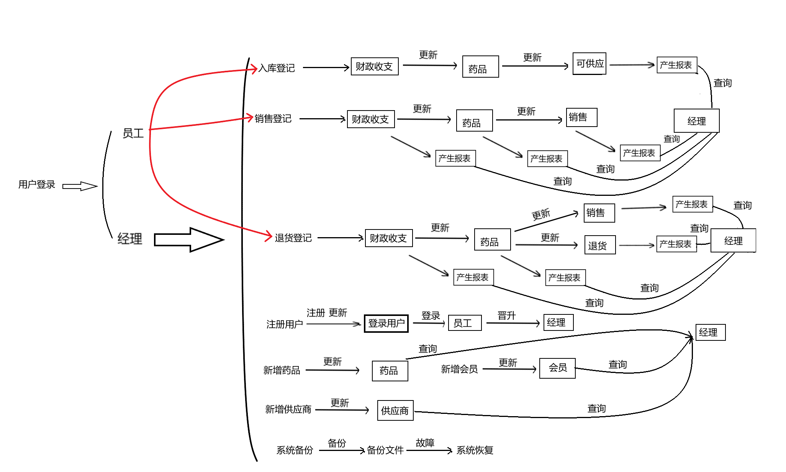
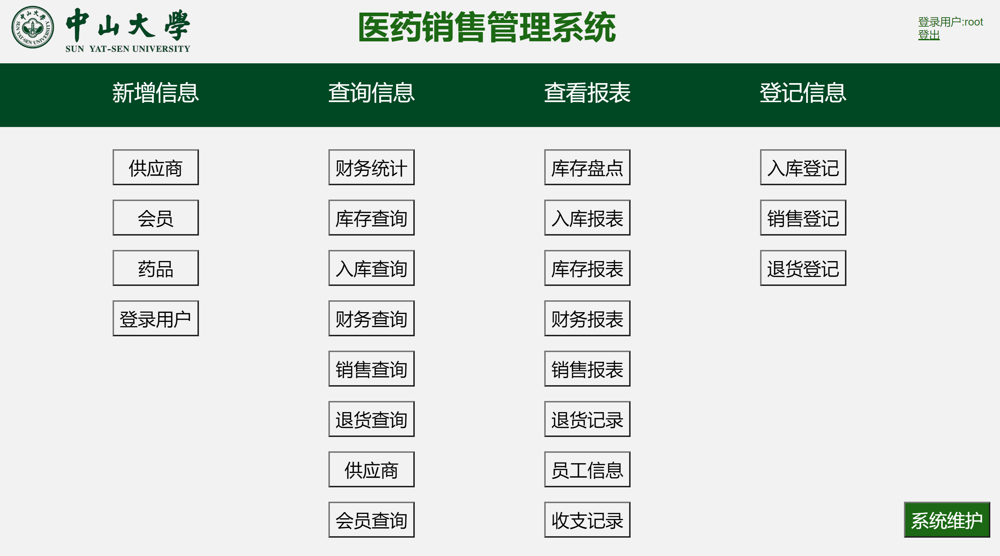

<center><b><font size = "7">《数据库系统》课程设计报告


<center><b><font size = "5">题目：医药销售管理系统


## 1 开发环境与开发工具

操作系统：Windows11

MySQL：MySQL 8.0.27

Apache：Apache httpd-2.4.52-win64-VS16

PHP：php-8.0.14-Win32-vs16-x64

浏览器：Microsoft Edge


## 2 系统需求分析

### 2.1 主要功能

本设计需要实现的是一个医药销售管理系统，主要功能包括： 

- 基础信息管理：药品信息、员工信息、客户信息、供应商信息等； 
- 进货管理：入库登记、入库登记查询、入库报表等； 
- 库房管理：库存查询、库存盘点、退货处理、库存报表等； 
- 销售管理：销售登记、销售退货、销售报表及相应的查询等； 
- 财务统计：当日统计、当月统计及相应报表等； 
- 系统维护：数据库备份与恢复

**功能概述**：

本系统拟实现一个简单的医药销售管理系统，具有简单的进库，销售，退货，财务统计功能。

该系统有两种登录用户类型，一种是普通员工，一种是经理；

- 普通用户登录时，只允许进行三种操作，入库登记，销售登记，退货登记；
- 经理登录时，允许进行下列操作：查看相关报表，注册新用户，添加供应商、会员、 药品；
- 任何用户都无权删除任何表上的数据，防止公职人员对财务数据造假，防止偷税漏税。


### 2.2 系统数据字典

数据字典通常包括数据项、数据结构、数据流、数据存储和处理过程5个部分。下面以数据字典卡片的形式来举例说明本系统的数据字典（**以下所有参照完整性都具有级联删除和更新，所有主码均为编号且为自增形式**）：

#### 2.2.1 数据结构

##### 实体集

**（1）供应商**

名字：供应商；

描述：记录供应商的基本信息；

定义：供应商 = 供应商编号 + 供应商名称 + 联系人 + 联系方式 + 所在地 ；其中供应商编号唯一标识不同的供应商；

完整性约束：供应商名称、联系人、联系方式要求非空。

**（2）药品**

名字：药品；

描述：记录药品的基本信息；


定义：药品 = 药品编号 + 药品名称 + 生产批号 + 产地 + 所属类别 + 进价 + 单价 + 会员折扣 + 库存 + 包装规格 + 生产日期 + 有效期，其中药品编号唯一标识不同的药品。

完整性约束：药品名称、进价、单价、库存、生产日期、有效期要求非空；会员折扣默认值为1。

**（3）会员**

名字：会员；

描述：记录会员（客户）的基本信息；

定义：会员 = 会员编号 + 会员姓名 + 联系方式，其中会员编号唯一标识不同的会员；

完整性约束：联系方式要求非空。

**（4）登录用户**

名字：登录用户；

描述：记录该系统的用户的基本信息；

定义：用户 = 用户编号 + 用户名 + 密码 + 类别，其中用户编号唯一标识不同的用户，用户名和密码用于登录该系统，类别有1和2，1表示普通员工，2表示经理；

完整性约束：用户名、密码要求非空；用户名要求不重复。

**（5）经理**

名字：经理；

描述：记录经理的基本信息；

定义：经理 = 经理编号 + 职位 ，其中经理编号唯一标识不同的经理；

完整性约束：职位默认为经理。

**（7）员工**

名字：员工；

描述：记录员工的基本信息；

定义：员工 = 员工编号 + 员工姓名 + 联系电话 ，其中员工编号唯一标识不同的员工

完整性约束：员工姓名、联系电话要求非空。

**（8）财政收支**

名字：财政收支；

描述：记录财政收支的具体明细，财政收支的情况以此收支单形式来记录；

定义：财政收支 = 收支编号 + 数量 + 日期 + 总额 + 类型 ，其中收支编号唯一标识不同的收支条款，数量为交易的药品数量，日期为交易日期，总额为该笔交易的总金额，类型为收支类型，本系统中有三种类型，入库，销售，退货。注意，入库和退货时金额为负，销售时金额为正。

完整性约束：日期、总额、类型要求非空。

##### 联系集

**（9）可供应**

名字：可供应；

描述：记录可以从供应商处进购的药品的信息，是实体集药品与供应商的联系集；

定义：可供应 = 供应商编号 + 药品编号 ，其中供应商编号给出可以从哪个供应商进货的信息，

完整性约束：供应商要求非空。

**（10）销售**

名字：销售；

描述：记录销售的收支编号以及消费者的会员编号，是实体集财政收支与会员之间的联系集；

定义：销售 = 会员编号 + 收支编号 ，其中收支编号给出这笔销售在财政收支中的位置，根据收支编号，可以在财政收支表中获取该笔交易的具体明细。

完整性约束：会员编号、收支编号要求非空且唯一标识一条销售记录。

**（11）退货**

名字：退货；

描述：记录退货的具体明细，是实体集财政收支与会员之间的联系集；

定义：退货 = 收支编号 + 销售编号 + 会员编号 ，其中收支编号唯一标识不同的退货条款，销售编号给出是哪笔销售退货的信息，为那笔销售记录的收支编号，收支编号给出这笔退货在财政收支中的位置，根据收支编号，可以在财政收支表中获取该笔交易的具体明细。

完整性约束：销售编号、收支编号要求非空；销售编号要求不重复。

**（12）商品**

名字：商品；

描述：记录财政收支中相关药品的信息，是实体集财政收支与药品之间的联系集；

定义：商品 = 收支编号 + 药品编号 

完整性约束：收支编号、药品编号为主码。

**（13）操作员**

名字：操作员；

描述：记录每笔交易的操作员工，是实体集财政收支与员工之间的联系集；

定义：退货 = 收支编号 + 员工编号 ，其中收支编号唯一标识不同的交易条款，员工编号给出是该笔交易的操作员工的员工编号。

完整性约束：会员编号、收支编号要求非空，且需满足外码约束；

**（14）晋升**

名字：晋升；

描述：记录员工晋升成经理的信息，是实体集经理与员工之间的联系集；

定义：晋升 = 经理编号 + 员工编号 ，

完整性约束：员工编号、经理编号要求非空，且需满足外码约束；

**（15）登录**

名字：登录；

描述：记录登陆用户与员工之间的对应信息，是实体集登陆用户与员工之间的联系集；

定义：登录 = 用户编号 + 员工编号 ；

完整性约束：员工编号、用户编号要求非空，且需满足外码约束；

#### 2.2.2 数据项

所有关系中，一共有多达47个数据项。这里仅给出不同意义下的数据项说明，其余定义仿照类似。

**（1）编号类**

包括供应商编号、药品编号、会员编号、用户编号、经理编号、员工编号、收支编号、入库编号、销售编号、退货编号等。

| 名字 | 收支编号                                                     |
| ---- | ------------------------------------------------------------ |
| 描述 | 唯一标识某项收支的数字编号                                   |
| 定义 | 整型数                                                       |
| 约束 | 自增                                                         |
| 位置 | 财政收支表（在财政收支表中为自增整型数），销售，退货， 操作员，商品 |

**（2）名称描述类**

包括：人名、地名、公司名、药名、联系方式等。

| 名字 | 供应商名称                                   |
| ---- | -------------------------------------------- |
| 描述 | 表示供应商的名称                             |
| 定义 | 可变长字符串，最大长度为50                   |
| 约束 | 必要信息要求非空；特别的，用户名要求不能重复 |
| 位置 | 供应商表                                     |

**（3）价格类**

包括：单价、进价、总额等。

| 名字 | 进价                                     |
| ---- | ---------------------------------------- |
| 描述 | 表示药品的进货价格                       |
| 定义 | 浮点型小数，总长度为10，小数点后保留两位 |
| 约束 | 非空                                     |
| 位置 | 药品表                                   |

**（4）折扣类**

| 名字 | 会员折扣                                |
| ---- | --------------------------------------- |
| 描述 | 表示会员加持下药品的折扣                |
| 定义 | 浮点型小数，总长度为3，小数点后保留两位 |
| 约束 | 非空（没有折扣为1）                     |
| 位置 | 药品表                                  |

**（5）数量类**

包括：库存、数量等。

| 名字 | 库存           |
| ---- | -------------- |
| 描述 | 表示药品的库存 |
| 定义 | 整形           |
| 约束 | 非空           |
| 位置 | 药品表         |

**（6）类型类**

| 名字 | 类型                                             |
| ---- | ------------------------------------------------ |
| 描述 | 标识某项收支的类型，有三种类型；入库，销售，退货 |
| 定义 | 可变长字符串，最长长度50                         |
| 位置 | 财政收支表                                       |

**（7）时间类**

| 名字 | 日期                   |
| ---- | ---------------------- |
| 描述 | 表示财政收支发生的时间 |
| 定义 | DATETIME时间类型       |
| 位置 | 财政收支表             |


#### 2.2.3 数据流

在本报告第四部分会给出整体数据流图，此处暂不展示；我们可以用”销售登记数据流“来说明：

数据流名：销售登记数据流；

说明：”销售“数据结构在系统内的流向；

数据流来源：员工接收事务；

数据流去向：销售处理事务；


#### 2.2.4 数据存储

这里我们以财政收支数据存储来说明：

数据存储名：财政收支表；

说明：财政收支数据，作为原始数据需要保存与备查；

编号：收支编号作为唯一标识，顺序整数，从1开始每次增加1；

输入的数据流：有入库数据流，销售数据流，退货数据流；

输出的数据流：财政收支数据流，用于经理查看报表；

数据结构：”财政收支“

#### 2.2.5 处理过程

下面说明各处理过程，具体的处理过程和完整性约束在5.2 数据库基本功能封装中阐述：

**（1）新增供应商**

说明：随着商业版图扩展，供应商也会不断增加，需要增加新的供应商信息；

输入：供应商名称, 联系人, 联系方式, 所在地；

输出：无；

处理：根据提供的输入，在供应商表中新增加数据；

新增药品，会员与此类似，不做赘述，其中：

- 新增药品输入：药品名称, 供应商编号, 生产批号, 产地, 所属类别, 进价, 单价, 会员折扣, 库存, 包装规格, 生产日期, 有效期；
- 新增会员输入：会员姓名, 联系方式；

**（2）新增登录用户**

说明：随着商业版图扩展，企业的员工也会不断增加，需要添加新的员工信息；

输入：用户登录名，用户登录密码，员工类型，员工真实姓名，员工联系电话；

输出：无；

处理：首先将对应的信息增加到员工和用户表中，再根据用户类型插入到经理表中；

**（3）注册用户**

说明：随着商业版图扩展，企业的员工也会不断增加，需要添加新的员工信息，为他们创建系统账户；

输入：用户登录名，用户登录密码，员工类型，员工真实姓名，员工联系电话；

输出：无；

处理：首先将调用增加登录用户存储过程，再在该数据库系统上创建新的用户，暂时先设置密码统一为1234；

**（4）入库登记**

说明：从供应商处进购药品，更新相关药品的库存，收支记录登记。

输入：药品编号，操作员工编号，进购数量，供应商编号；

输出：无；

处理：首先需要检查是否存在该药品编号、员工编号、供应商编号，若不存在则异常不予执行，且入库数量需大于0，不满足也不予执行。满足基本条件之后，先在财政收支表中增加本次交易的收支明细，得到该记录的财政收支编号，更新药品库存，再将此次入库存入商品表和操作员表中。

**（5）销售登记**

说明：售卖药品给会员，更新相关药品的库存，收支记录登记。

输入：药品编号，操作员工编号，销售数量，会员编号；

输出：无；

处理：首先需要检查是否存在该药品编号、员工编号、会员编号，若不存在则异常不予执行，且销售数量不得大于库存，不满足也不予执行。满足基本条件之后，先在财政收支表中增加本次交易的收支明细，得到该记录的财政收支编号，更新药品库存，再将此次销售记录存入商品、操作员、销售表中。

**（6）退货登记**

说明：会员退货，更新相关药品的库存，收支记录登记。

输入：销售编号，操作员工编号；

输出：无；

处理：首先需要检查是否存在该销售编号、员工编号，若不存在则异常不予执行，且该销售编号对应的销售不能已经执行过退货操作，若已经退货过不得重新退货。满足基本条件之后，先在财政收支表中增加本次交易的收支明细，得到该记录的财政收支编号，更新药品库存，再将此次退货记录存入商品、操作员、退货表中。

**（7）库存盘点**

说明：给出当前的药品库存情况；

输入：无

输出：查询时刻药品的状态，包括药品.*, 供应商名称, 供应商联系人, 供应商联系方式。

**（8）财务报表**

说明：给出财务收支的每条记录的具体明细

输入：无；

输出：收支编号, 财政收支的类型, 相关药品的药品编号, 药品的药品名称, 交易数量,交易总额,，交易日期, 库存, 经办员工姓名；

**（9）财务统计**

说明：给出某段时间内财务收支总体盈亏情况；

输入：日期（输入模糊匹配，如“2021-05-19%”）

输出：财政收支记录条数，盈亏，支出，收入；

**（10）销售查询**

说明：给出某段时间内某种药品的的销售记录明细；

输入：药品名称，日期（输入模糊匹配，如“2021-05-19%”）

输出：收支编号，药品编号, 药品名称，单价，销售数量， 会员折扣， 交易金额, 交易日期 , 会员姓名， 员工姓名；

**（11）其他**

本系统还设计有其他的处理过程，此处不一一详述，有如下过程：库存盘点，入库报表，库存报表，财务报表，收支记录，销售报表，退货记录，员工信息，财务统计，库存查询，入库查询，财务查询，销售查询，退货查询，供应商查询，会员查询。


## 3 功能需求分析

医药销售系统的的功能如上所述，因为并不是需要做出一个功能极其完善的管理系统，所以本设计主要是完成了系统需求分析中提出的基本的功能需求，系统功能模块如下图所示：

#### 系统功能模块图

系统的功能模块整体如下所示：


对功能再进一步的进行整合，我们可以得到更加细致且合理的功能模块设计，整合之后的功能模块图虽然打乱了设计模块，但是得到了更加合理的功能分类。

对于拥有管理权的管理层来说，功能如下：


对于普通的操作人员，功能如下：


## 4 系统设计

### 4.1 数据概念结构设计

**具体的功能设计以及完整性约束在5.1数据库的建立以及5.2数据库基本功能封装中阐述。**

（1）数据流程图

在仔细分析调查有关信息需要的基础上得到本医药销售管理的整体数据流图，如下所示。




（2）系统ER图

在充分需求分析的基础上，经过逐步抽象、概括、分析、充分研讨，可画出本医药销售管理系统的整体ER图，如下所示：


### 4.2 数据库关系模式设计

**更详细的关系分析以及完整性约束，在2.2系统数据字典中阐述。**

按照ER图到逻辑关系模式的转换规则，可以得到本系统需要管理的实体信息如下：

（1）供应商（供应商编号，供应商名称，联系人，联系方式，所在地）；

（2）药品（药品编号，药品名称，生产批号，产地，所属类别，进价，单价，会员折扣，库存，包装规格，生产日期，有效期）；

（3）会员（会员编号，会员姓名，联系方式）；

（4）登录用户（用户编号，用户名，密码，类别）；

（5）经理（经理编号，职位）；

（6）员工（员工编号，员工姓名，联系电话）；

（7）财政收支（收支编号，数量，日期，总额，类型）；

本系统需要管理的联系集信息如下：

（1）登录（员工编号，用户编号）；

（2）晋升（员工编号，经理编号）；

（3）可供应（药品编号，收支编号）；

（4）操作员（员工编号，收支编号）；

（5）销售（会员编号，收支编号）；

（6）退货（会员编号，销售编号，收支编号）；

（8）商品（药品编号，收支编号）；

下面给出部分实体（供应商、财政收支、登录用户）及其属性图：

      

下面给出系统部分（退货、商品）联系及其属性图：

<center>    


### 4.3 数据库物理结构设计

物理结构设计的原则如下：

1. 确定数据库的物理结构，在关系数据库中主要指存取方法和存储结构。
2. 对物理结构进行评价，评价的重点是时间和空间效率。

#### 4.3.1 减少冗余

​		为了减少数据冗余：

1. 数据库的设计以财政收支为中心，将销售和退货作为连接财政收支和会员的一个联系存在，使得销售和退货的两个表格中，只存在不同于财政收支的属性，类似于关系的特化，减少了数据的冗余。
2. 另一个方面，将经理和员工的平行关心，修改为晋升关系，使得经理中只保留经理特有的属性，减少了数据冗余。
3. 退货的前提是销售，为了避免设计庞大的关系，将退货和销售分离开，并将销售编号作为退货的一个联系属性。

​		减少数据冗余，一个目的是为了尽量避免数据维护中出现更新，插入，删除异常。插入异常是指如果表中的某个实体随着另一个实体而存在。更新异常是指如果更改表中的某个实体的单独属性时，需要对多行进行更新。删除异常是指如果删除表中的某一实体则会导致其他实体消失。为了避免这个问题的产生，将所有的更新，插入，删除设计为存储过程，在存储过程中完成整个逻辑的设计。

#### 4.3.2 数据类型设计

​		数据类型设计的原则是，当一个列可以选择多种数据类型时，应该优化考虑数字类型，其次是日期或者二进制类型，最后是字符串类型。对于相同级别的数据类型，应该优化考虑占用空间小的数据类型。

​		系统的存储引擎采用Innodb引擎，Innodb一页是16K。

- tinyint 占1个字节
- smallint占2个字节
- mediumint占3个字节
- int占4个字节
- bigint占8个字节
- float 占4个字节
- double占8个字节
- decimal 每4个字节存9个数据，小数点占1个字节。
- year占1个字节
- time占3个字节
- date占3个字节
- datetime占8个字节
- timestamp占4个字节

##### 4.3.2.1 varchar

​		比较 char 和 varchar的特点和使用场景。

varchar的特点：

1. varchar用于存储变长字符串，只占用必要的存储空间，最多65535。
2. varchar的最大长度小于255，则占用一个额外字节记录字符串长度。大于255，则占用2个额外字节用于记录字符串长度。

varchar的适用场景：

1. 字符串的最大长度比平均长度大很多。

2. 字符串很少被更新。

3. 使用了多字节字符集来存储字符串。

char类型的存储特点：

1. char类型是定长的。

2. 字符串存储在char类型的列中会删除末尾的空格。

3. 最大宽度为255。

char适用的场景：

1. char类型适用于存储所有长度近似的值。

2. char类型适合存储短字符串。

3. char类型适用存储经常更新的字符串，可以避免形成存储碎片。

​		综合考虑数据表中所需要存储的信息，满足varchar的特点，因此均采用varchar。由于varchar只占用必要的存储空间，因此将最大长度设置到足够的长度，即50。

##### 4.3.2.2 datetime

​		datetime类型以YYYY-MM-DD HH:MM:SS.[fraction]格式存储日期时间。考虑存储日期格式相关的数据时，要注意以下几点：

1. 比较字符串类型和datetime：
   - 日期时间类型通常要比字符串占用的存储空间小。
   - 日期时间类型有丰富的处理函数，可以更加方便对日期类型数据进行日期过滤。
2. 比较int类型和datetime：
   - 日期时间类型通常要比int占用的存储空间小。
3. 日期类型在进行查询过滤时，可以利用日期来进行对比，避免隐式转换造成索引全盘扫描。

#### 4.3.3 索引

​		当随着数据量的增加，比起未加索引的情况，加了索引后，查询效率提高非常明显。

​		索引设计有几个注意要点：

- 索引字段要尽量的小。这由B+树这个数据结构所决定。
- 索引的最左匹配特性。对于组合索引，查询的时候会从左到右进行匹配。
- 索引列尽量不要参与运算。

​		在设置主键的时候，MySQL会默认增加主键索引。由于每一个表的主键都是该表的编号，而在查询的过程中，大部分也采用编号的方式进行查询。因此，大部分的表格不需要特别设置索引。

​		考虑一些特殊的表格：

1. 销售、退货和商品：这三个表格通常与财政收支同时进行查询，而连接这三个表格和财政收支的属性，是收支编号；在大部分的功能查询当中，也是使用了`order by`语句，而排序的属性也是收支编号，因此这三个表格使用收支编号作为索引。
2. 在登录用户表中，作为登录的时候的匹配表格，用户名是其唯一标识，而且用户名是不重复的。索引的设计尽量要选择区分度高的属性，因此采用用户名作为索引。由于用户名是其唯一标识，因此采用唯一索引。
3. 跟登录用户表同样的道理，会员表采用联系方式作为索引。由于联系方式不要求不重复，因此建立普通索引。

#### 4.3.4 查询优化

​		为了减少查询过程中，临时空间的消耗，在多个表格查询的时候，尽量不适用笛卡尔积进行表格的连接，而采用自然连接和外连接的方式。如入库报表：

```mysql
DROP VIEW IF EXISTS 入库报表; 
CREATE VIEW 入库报表 AS
    SELECT 财政收支.收支编号, 药品名称, 供应商名称, 员工姓名, 数量, 日期, 总额 ,财政收支.类型
    FROM 财政收支 , 商品 natural join 药品 natural join 可供应 natural join 供应商 , 操作员 natural join 员工 
    where 财政收支.收支编号 = 商品.收支编号
      and 财政收支.收支编号 = 操作员.收支编号
    order BY  收支编号, 财政收支.日期;
```

​		还有一个可以优化的点在于，连接匹配的时候又最左匹配原则，因此查询的时候，首先进行收支编号的匹配。这样能够最大程度地运用索引的数据结构的性能。

### 4.4 数据库的建立

本系统数据库表的物理设计通过创建表的SQL命令来呈现。创建数据库表的SQL命令如下：

#### 4.4.1 创建

```mysql
DROP DATABASE IF EXISTS 医药销售管理系统;
CREATE DATABASE 医药销售管理系统;
USE 医药销售管理系统;
```

#### 4.4.2 实体集

```mysql
CREATE TABLE `供应商`(
    供应商编号     INT AUTO_INCREMENT,
    供应商名称     VARCHAR(50) NOT NULL,
    联系人         VARCHAR(50) NOT NULL,
    联系方式       VARCHAR(50) NOT NULL,
    所在地         VARCHAR(50),
	PRIMARY KEY (`供应商编号`)
);

CREATE TABLE `药品`(
    药品编号    INT AUTO_INCREMENT,
    药品名称    VARCHAR(50) NOT NULL,
    生产批号    VARCHAR(50),
    产地        VARCHAR(50),
    所属类别    VARCHAR(50),
    进价        DECIMAL(10,2) NOT NULL,
    单价        DECIMAL(10,2) NOT NULL,
    会员折扣    DECIMAL(3,2) DEFAULT 1,
    库存        INT NOT NULL,
    包装规格    VARCHAR(50),
    生产日期    VARCHAR(50) NOT NULL,
    有效期      VARCHAR(50) NOT NULL,
	PRIMARY KEY (`药品编号`)
);


CREATE TABLE `会员`(
    会员编号      INT AUTO_INCREMENT,
    会员姓名      VARCHAR(50),
    联系方式      VARCHAR(50) NOT NULL,
	PRIMARY KEY (`会员编号`),
    INDEX `联系方式索引` (`联系方式`)
);

-- 类别为1代表员工，2代表经理
CREATE TABLE `登录用户`(
    用户编号         INT AUTO_INCREMENT,
    用户名           VARCHAR(50) NOT NULL UNIQUE,
    密码            VARCHAR(50) NOT NULL,
    类别            INT NOT NULL,
	PRIMARY KEY (`用户编号`),
    UNIQUE (`用户名`)
);

CREATE TABLE `经理`(
    经理编号      INT AUTO_INCREMENT,
	职位 VARCHAR(50) DEFAULT "经理"
);

CREATE TABLE `员工`(
    员工编号      INT AUTO_INCREMENT,
    员工姓名      VARCHAR(50) NOT NULL,
    联系电话      VARCHAR(50) NOT NULL,
	PRIMARY KEY(员工编号)
);

CREATE TABLE `财政收支` (
	收支编号 INT AUTO_INCREMENT,
	数量			 INT,
	日期			 DATETIME NOT NULL,
	总额			 DECIMAL(10,2) NOT NULL,
	类型			 VARCHAR(50)  NOT NULL,
	PRIMARY KEY (`收支编号`)
);
```

#### 4.4.3 联系集

```mysql
CREATE TABLE `登录`(
    员工编号 INT NOT NULL,
    用户编号 INT NOT NULL,
    PRIMARY KEY (`员工编号`,`用户编号`),
    FOREIGN KEY (`员工编号`) REFERENCES `医药销售管理系统`.`员工` (`员工编号`)
	ON DELETE CASCADE
	ON UPDATE CASCADE,
	FOREIGN KEY (`用户编号`) REFERENCES `医药销售管理系统`.`登录用户` (`用户编号`)
	ON DELETE CASCADE
	ON UPDATE CASCADE
);

CREATE TABLE `晋升`(
    员工编号 INT NOT NULL,
    经理编号 INT NOT NULL,
    PRIMARY KEY (`员工编号`,`经理编号`),
    FOREIGN KEY (`员工编号`) REFERENCES `医药销售管理系统`.`员工` (`员工编号`)
	ON DELETE CASCADE
	ON UPDATE CASCADE,
	FOREIGN KEY (`经理编号`) REFERENCES `医药销售管理系统`.`经理` (`经理编号`)
	ON DELETE CASCADE
	ON UPDATE CASCADE
);


CREATE TABLE `可供应`(
    药品编号 INT NOT NULL,
    供应商编号 INT NOT NULL,
    PRIMARY KEY (`药品编号`,`供应商编号`),
    FOREIGN KEY (`药品编号`) REFERENCES `医药销售管理系统`.`药品` (`药品编号`)
	ON DELETE CASCADE
	ON UPDATE CASCADE,
	FOREIGN KEY (`供应商编号`) REFERENCES `医药销售管理系统`.`供应商` (`供应商编号`)
	ON DELETE CASCADE
	ON UPDATE CASCADE
);

CREATE TABLE `操作员` (
    收支编号 INT NOT NULL,
    员工编号 INT NOT NULL,
    PRIMARY KEY (`收支编号`),
    FOREIGN KEY (`收支编号`) REFERENCES `医药销售管理系统`.`财政收支` (`收支编号`)
    ON DELETE CASCADE
    ON UPDATE CASCADE,
    FOREIGN KEY (`员工编号`) REFERENCES `医药销售管理系统`.`员工` (`员工编号`)
    ON DELETE CASCADE
    ON UPDATE CASCADE
);

CREATE TABLE  `销售` (
    收支编号 INT NOT NULL,
    会员编号 INT NOT NULL,
    PRIMARY KEY (`收支编号`),
    FOREIGN KEY (`收支编号`) REFERENCES `医药销售管理系统`.`财政收支` (`收支编号`)
    ON DELETE CASCADE
    ON UPDATE CASCADE,
    FOREIGN KEY (`会员编号`) REFERENCES `医药销售管理系统`.`会员` (`会员编号`)
    ON DELETE CASCADE
    ON UPDATE CASCADE,
    INDEX `收支编号索引` (`收支编号`)
);

CREATE TABLE `退货` (
    收支编号 INT NOT NULL,
    会员编号 INT NOT NULL,
    销售编号 INT NOT NULL UNIQUE,
    PRIMARY KEY (`收支编号`),
    FOREIGN KEY (`收支编号`) REFERENCES `医药销售管理系统`.`财政收支` (`收支编号`)
    ON DELETE CASCADE
    ON UPDATE CASCADE,
    FOREIGN KEY (`会员编号`) REFERENCES `医药销售管理系统`.`会员` (`会员编号`)
    ON DELETE CASCADE
    ON UPDATE CASCADE,
    FOREIGN KEY ( `销售编号`) REFERENCES `医药销售管理系统`. `销售` (`收支编号`)
    ON DELETE CASCADE
    ON UPDATE CASCADE,
    INDEX `收支编号索引` (`收支编号`)
);

CREATE TABLE `商品`(
	收支编号 INT NOT NULL,
    药品编号 INT NOT NULL,
    PRIMARY KEY (`收支编号`,`药品编号`),
    FOREIGN KEY (`收支编号`) REFERENCES `医药销售管理系统`.`财政收支` (`收支编号`)
    ON DELETE CASCADE
    ON UPDATE CASCADE,
    FOREIGN KEY (`药品编号`) REFERENCES `医药销售管理系统`.`药品` (`药品编号`)
    ON DELETE CASCADE
    ON UPDATE CASCADE,
    INDEX `收支编号索引` (`收支编号`)
);
```


## 5 系统功能的实现

### 5.1 数据库基本功能概述

为了功能模块调用的便捷性，将各个功能模块进行封装，采用视图或者带参数的存储过程的形式，使用的时候可以直接显示试图或者调用存储过程。

#### 5.1.1查看报表（视图）

（1）库存盘点要反映：药品编号，药品名称，供应商编号，生产批号，产地，所属类别，进价，单价，会员折扣，库存，包装规格，生产日期，有效期，供应商名称，供应商联系人，供应商联系方式；

（2）入库报表要反映：入库编号，药品名称，供应商名称，员工姓名，入库数量，日期，入库金额总额；

（3）库存报表要反映：收支编号，收支类型，药品编号，药品名称，交易数量，日期 , 员工姓名；

（4）财务报表要反映： 收支编号， 收支类型，药品编号，药品名称，交易数量，交易金额， 日期,，药品库存， 员工姓名；

（5）收支记录要反映：收支编号，收支类型，药品名称，交易数量，交易总额，交易日期；

（6）销售报表要反映：收支编号，药品编号，药品名称，单价， 数量， 会员折扣， 总额， 日期 ， 会员姓名， 员工姓名；

（7）退货记录要反映：收支编号，对应的销售的收支编号，药品名称，数量，总额， 日期 ， 会员姓名， 员工姓名；

（8）员工信息要反映：用户名，员工编号，员工姓名，联系电话，用户编号

#### 5.1.2 查询信息（存储过程）

（9）给定日期财务统计要反映：周期内收支数，盈亏，支出，收入；

（10）给定药品名称，库存查询要反映：药品名称，供应商名称，生产批号，产地，所属类别，单价，会员折扣，库存，有效期；

（11）给定药品名称和日期，入库查询要反映：收支编号，药品名称，供应商名称，员工姓名，入库数量，日期，入库金额总额；

（12）给定药品名称和日期，财务查询要反映：收支编号，交易类型，药品编号，药品名称，数量， 总额， 日期 ，员工姓名；

（13）给定药品名称和日期，销售查询要反映：收支编号，药品编号，药品名称，单价， 数量， 会员折扣， 总额， 日期 ， 会员姓名， 员工姓名；

（14）给定药品名称和日期，退货查询要反映：收支编号，对应的销售的收支编号，药品名称，数量，总额， 日期 ， 会员姓名， 员工姓名；

（15）给定供应商名称，供应商查询要反映： 供应商编号，供应商名称，联系人，联系方式，所在地，药品名称，单价，会员折扣，数量， 总额， 日期；

（16）给定会员电话，会员查询要反映：会员编号，会员姓名，联系方式，药品名称，单价，会员折扣，数量， 总额， 日期 ， 员工姓名

#### 5.1.3 新增信息（存储过程）

（17）给定供应商的名称、联系人、联系电话、地址，新增供应商要实现供应商表的插入；

（18）给定会员的名称、联系电话，新增会员要实现供应商表的插入；

（19）给定药品的名称、供应商编号，生产批号，产地，所属类别，进价，会员折扣，包装规格，生产日期，有效期，新增药品要实现药品表和可供应表的插入；

（20）给定登录向户名，用户密码，用户类型，用户真实姓名，电话，新增登录用户要实现员工、登录、经理、晋升表的插入；

#### 5.1.4 登记信息（存储过程）


#### 5.1.5 触发器

```mysql

```

上述物理结构的设计都是根据本报告2.2节数据字典进行设计的，具体的含义不再赘述。

### 5.2 数据库基本功能封装

为了功能模块调用的便捷性，将各个功能模块进行封装，采用视图或者带参数的存储过程的形式，使用的时候可以直接显示试图或者调用存储过程。

#### 5.2.1 带参数查询

该部分用于查询数据库表中的基本信息，具体的参数设计在4.2数据库关系模式设计中阐述。

```mysql

```

#### 5.2.2 模糊查询

该部分用于根据药名和日期进行财务方面的模糊查询。

- 药名：如果单独查询，必须精确匹配；同日期同时查询，可以进行模糊匹配，原因在于，用户不一定同时输入日期和药名，可能只会输入一个，保证用户只输入日期，也可以进行查询。
- 日期：模糊匹配，保证用户无论输入年、月、日或者时间，均可以找到对应的记录。

```mysql

```

#### 5.2.3 插入

该部分的插入设计复杂的逻辑，逐个进行解析。

##### 5.2.3.1 供应商、会员和药品

该部分直接使用插入语句即可。

```mysql

```

##### 5.2.3.2 登录用户

由于该登录用户不仅需要在用户表中插入信息，还需要插入mysql本身的用户表当中，即真实地在mysql中新建用户。

1. 在医药销售管理系统的用户表中插入信息；
2. 在mysql中新建用户，默认用户名为temp，密码为1234；
3. 修改用户名为用户输入的用户名；
4. 在php功能模块中，采用cmd的方式修改密码。

```mysql

```

##### 5.2.3.3 入库登记

1. 满足数据库的完整性约束：入库数量大于0、药品存在、员工存在、供应商存在。
2. 找到财政收支中对应的收支编号。
3. 入库登记。

```mysql

```

##### 5.2.3.4 销售登记

1. 满足数据库的完整性约束：库存足够、药品存在、员工存在、供会员存在。
2. 找到财政收支中对应的收支编号。
3. 销售登记。

```mysql

```

##### 5.2.3.5 退货登记

1. 满足数据库的完整性约束：存在销售记录、员工存在、未曾进行退货。
2. 找到财政收支中对应的收支编号。
3. 退货登记。

```mysql

```


### 5.3 数据库连接通用模块

本系统采用Apache和PHP架构，搭建在localhost下，采用浏览器网页的形式。功能界面采用html实现和美化，数据库连接模块采用PHP嵌入式语言。

#### 5.3.1 配置环境

见附件8.1，相关代码放置在`目录:apache\httpd-2.4.52-win64-VS16\Apache24\htdocs`下。

**默认账号是root，密码是1234。**

#### 5.3.2 连接数据库

​		php中，连接数据库的方式有很多。为了对模块更好的设计，采用了面向对象的方式。`mysqli`是一种面向对象的数据库连接方式，在连接前需要实例化一个对象，然后通过这个对象进行数据库操作。同时，mysqli是一种长连接方式，并且比mysql_connect更加安全。

其基本语法如下：

```php
$con = new mysqli("localhost","root","password","db_name");
if (!mysqli_connect_error()) {
	$sql = "select * from table_name where id=1";
	$result = $con->query($sql);
	while ($row = $result->fetch_row($result)) {
    	echo "$row";
	}
} else {
	die("无法连接数据库".mysql_error());
}
```

其中

- `mysqli_connect_error()`用于判断数据库是否连接成功，返回值为一个布尔类型
- `mysqli`中接口`query`表示输入字符串类型的mysql语句，返回值为该mysql语句执行的结果
- `fetch_row`是将mysql语句执行的结果按行进行遍历，返回值为每一行的结果，为一个数组
- `mysql_error()`用于错误反馈

#### 5.3.3 插入模块设计

​		第一步是读取当前用户的账号和密码。

```php
$fp = fopen("login.txt", "r");
$user = fgets($fp);
$user = substr($user, 0, -1);
$password = fgets($fp);
$password = substr($password, 0, -1);
$type = fgets($fp);
fclose($fp);
```

​		随后连接数据库，并做连接失败处理。

```php
$link = mysqli_connect('localhost', $user, $password, '医药销售管理系统', '3306');
if(!$link) {
    exit('数据库连接失败!');
}
```

​		由于插入部分由输入界面的一个post动作触发，在插入前，先获取用户在文本框中输入的参数，在此以添加供应商为例子。

```php
$fname = $_POST["fname"];
$man = $_POST["man"];
$phone = $_POST["phone"];
$location = $_POST["location"];
```

​		得到插入需要的参数后，生成mysql语句，并在数据库中执行该语句。由于上述已经将各功能模块进行封装，因此只需要调用存储过程即可。

```php
$sql = 'call 新增供应商("'.$fname.'","'.$man.'","'.$phone.'","'.$location.'");';
$res = mysqli_query($link, $sql);
```

​		如果添加成功，则刷新页面并返回主界面（根据当前用户的类别选择返回的界面）；否则，显示添加失败，并提供返回主界面的超链接。

```php
if ($res) {
  echo "添加成功!";
  if ($type == "1")
    echo '<meta http-equiv="refresh" content="1;url=main-staff.php">';
  else
    echo '<meta http-equiv="refresh" content="1;url=main-manager.php">';
}  else {
    echo "添加失败!";
  if ($type == "1")
    echo '<a href="main-staff.php">返回</a>';
  else
    echo '<a href="main-manager.php">返回</a>';
}
```

#### 5.2.4 更新模块设计

​		**由于模块已经封装，更新模块的设计同插入模块形式一致，不再赘述。**

#### 5.3.4 查询模块设计

​		理论上，查询模块的设计和插入模块的。不同之处在于，插入和更新模块都是没有输出的，因此查询模块额外需要打印结果的考量。众所周知，在非聚集函数的SELECT语句的结果通常是一个关系，因此，在得到mysql语句的执行结果后，需要按行进行遍历。返回的对象中，每一行都是一个数组，代表了每一个属性的取值，将其打印即可。

```php+HTML
$res = mysqli_query($link, $sql);
while($row = mysqli_fetch_array($res)) {
    echo '<tr align="center">';//居中

    echo "<td>$row[0]</td>";
    echo "<td>$row[1]</td>";
    echo "<td>$row[2]</td>";
    echo "<td>$row[3]</td>";
    echo "<td>$row[4]</td>";
    echo "<td>$row[5]</td>";
    echo "<td>$row[6]</td>";
    echo "<td>$row[7]</td>";
    echo '</tr>';
}
```

​		另一个不同之处在于，需要对输入的药名和日期进行处理，在字符串的首位加入模糊匹配标志，使得无论是否输入，均可进行查询。并且，能够将日期进行模糊匹配，使得输入年、月、日或者时间均能找到对应的记录。

```php+HTML
$dat = '%'.$_POST["dat"].'%';
$fname = '%'.$_POST["fname"].'%';
$sql = "CALL 销售查询('".$fname."','".$dat."');";
$res = mysqli_query($link, $sql);
```


#### 5.3.5 备份模块设计

​		系统维护需要对数据库中的数据进行备份。数据库备份采用mysqldump，它的备份原理是通过协议连接到 MySQL 数据库，将需要备份的数据查询出来，将查询出的数据转换成对应的 insert 语句，当我们需要还原这些数据时，只要执行这些 insert 语句，即可将对应的数据还原。

```php+HTML
<?php
    $filename=date("Y-m-d_H-i-s")."-"."Backup".".sql";
    $tmpFile = (dirname(__FILE__))."\\".$filename;
    $sql = "mysqldump -uroot -p1234 --default-character-set=utf8 --all-databases > ".$tmpFile;
    exec($sql, $out, $return_val);
    if ($return_val == 0)  {
        echo "备份成功!";
        echo '<meta http-equiv="refresh" content="1;url=main-manager.php">';
    } else {
        echo "备份失败!<br>";
        echo "请手动在cmd中输入如下命令:<br>";
        echo $sql."<br>";
        echo '<a href="main-manager.php">返回</a>';
    }
?>
```

​		但是采用php连接cmd并不如直接cmd稳定，针对不同的主机可能会产生执行失败。因此，针对执行失败的情况，在网页中生成cmd命令，提供给用户自行备份。


### 5.4 功能界面的实现

​		功能界面的实现不是课程设计的主要部分，因此对代码不作详细解释，仅作设计上的分析与考量。考虑到html语言的特殊性，加上注释会使得整个代码杂乱无章，尤其是html内嵌php更是如此。因此，代码中基本不参杂注释。

#### 5.4.1 登录页面

​		登录界面需要账号、密码以及登录按钮。界面如下：


账号采用文本框的形式，而密码需要采用密码的形式，使得输入的密码隐藏。当按下登录按钮后，会触发登录检查动作：

```php+HTML
<body>
  <div class="content">
     <div>
         <h1 align="center">医药销售管理系统</h1>
     <dl>
        <form action="login.php" method="post">
          <p align="center">账号: <input type="text" name="fname"><br></p>
          <p align="center">密码: <input type="password" name="password"><br></p>
          <p align="center"><input type="submit" value="登录" style="height: 25px;width: 200px"><br></p>
      	</from>
      </div>
    </div> 
</body>
```

​		在获取输入的账号和密码后，首先连接数据库，并在登录用户表中检查是否存在该账号以及密码检测。

- 如果账号和密码正确，感觉该账号的权限，选择跳到管理层主页或者普通员工主页
- 如果账号或密码错误，打印错误信息，并返回登录界面

值得注意的是，由于在后续系统操作的时候，连接数据库需要该用户的账号和密码，因此需要将该账号和密码写入一个文件`login.txt`当中，以便后续读取。

​		对于经理和普通员工的主页分离开的原因在于，两者的权限不同，这样保证了员工无法僭越。

```php+HTML
<?php
    $link = mysqli_connect('localhost', 'root', '1234', '医药销售管理系统', '3306');
    if(!$link) {
        exit('数据库连接失败!');
    }
    $fname = $_POST["fname"];
    $password = $_POST["password"];
    $res = mysqli_query($link, "SELECT 类别
                                FROM 登录用户 
                                WHERE 用户名 = '$fname' AND 密码 = '$password'");
    $flag = 0;
    while ($row = mysqli_fetch_array($res)) {
        echo '登录成功';
        $flag = 1;
        $fp = fopen("login.txt", "w");
        fwrite($fp, $fname."\n");
        fwrite($fp, $password."\n");
        fwrite($fp, $row[0]."\n");
        fclose($fp);
        if ($row[0] == 1)
            echo '<meta http-equiv="refresh" content="0;url=main-staff.php">';
        else
            echo '<meta http-equiv="refresh" content="0;url=main-manager.php">';
    }
    if ($flag == 0) {
        echo "登录失败(账号或密码错误)";
        echo '<a href="index.html">返回</a>';
    }
?>
```

#### 5.4.2 主页面的设计

对于**管理层主页**，需要实现的功能有：

- 新增信息：供应商、会员、药品、登录用户
- 查询信息：财务统计、库存管理、入库查询、财务查询、销售查询、退货查询、供应商、会员查询
- 查看报表：库存盘点、入库报表、库存报表、财务报表、销售报表、退货记录、员工信息、收支记录
- 登记信息：入库登记、销售登记、退货登记
- 系统维护
- 用户名的显示和登出

对于新增信息、查询信息、查看报表、登记信息将其分为四类，每一个功能通过一个按钮触发，将其按照类别进行排版。而系统维护同样采用一个按钮触发存储过程。而用户名的显示和登出，按照普遍的网页设置，将其放在页面的右上角，并采用一个超链接的方式，将登出连接到登录界面。



功能模块的按钮设计如下：

```php+HTML
<form action="" method="post" name="indexf">
    <input type="button" value="供应商" name="inbut" style='color:#000000;width:120px;height:50px;background-color:transparent;font-size:25px;position:absolute;left:200px;top:210px' onClick="location.href = 'insert_supplier.html'">
    ...
```

其中，需要设置按钮的颜色，大小，文字以及位置，并设置触发事件。

对于**普通员工主页**，需要实现的功能只有：

- 登记信息：入库登记、销售登记、退货登记
- 用户名的显示和登出

该部分的功能为经理主页的子集，不再赘述。

#### 5.4.3 插入界面

​		插入界面的设计采用和登录界面同样的形式，提供文字框给用户输入即将插入的信息，并设置确定键，使得将用户输入的信息传输给系统，系统执行插入。


#### 5.4.4 查询统计界面

​		查询的结果以表格的形式呈现，需要查询的内容以文本框的形式，提供给用户输入结构，并提供查询按钮给定用户确认需要查询的内容。


查询部分使用一个post事件，用户在文本框中输入，查询按钮触发事件，向系统post用户输入的信息。

```php+HTML
<form action="" method="post" name="indexf">
<p align="center" style='position:absolute;left:450px;top:170px'>
    药名：
    <input type="text" name="fname">
    日期：
    <input type="text" name="dat">
    <input type="submit" value="查询" name="selsub">
</p>
```

而表格部分则将用户查询的内容呈现：

```php+HTML
<table align="center" border="1px" cellpadding="0px" width="1200px" style='position:absolute;left:150px;top:220px'>
    <tr><th>销售编号</th><th>药品编号</th><th>药品名称</th><th>单价</th><th>数量</th><th>总额</th><th>会员折扣</th><th>日期</th><th>会员姓名</th><th>员工姓名</th></tr>
    <?php
        ...
        if (!empty($_POST["selsub"])) {
            $dat = $_POST["dat"];
            $fname = $_POST["fname"];
            $sql = "CALL 销售查询('".$fname."','%".$dat."%');";
            $res = mysqli_query($link, $sql);
            while($row = mysqli_fetch_array($res)) {
                echo '<tr align="center">';//居中

                echo "<td>$row[0]</td>";
                echo "<td>$row[1]</td>";
                echo "<td>$row[2]</td>";
                echo "<td>$row[3]</td>";
                echo "<td>$row[4]</td>";
                echo "<td>$row[5]</td>";
                echo "<td>$row[6]</td>";
                echo "<td>$row[7]</td>";
                echo "<td>$row[8]</td>";
                echo "<td>$row[9]</td>";
                echo '</tr>';
            }
        }
    ?>
</table>
</form>
```

而用户查询结束后，通过”返回主界面“按钮返回主页。该部分同样需要判断用户的类型，从文件中读取用户是经理还是普通员工，返回相应的界面。

```php+HTML
$fp = fopen("login.txt", "r");
$user = fgets($fp);
$user = substr($user, 0, -1);
$password = fgets($fp);
$password = substr($password, 0, -1);
$type = fgets($fp);
fclose($fp);
if ($type == "1")
    echo '<input type="button" value="返回主界面" name="inbut" style="color:#ffffff;width:150px;height:50px;background-color:#1c6814;font-size:25px;position:absolute;left:1200px;top:110px" onClick="location.href = \'main-staff.php\'">';
else
    echo '<input type="button" value="返回主界面" name="inbut" style="color:#ffffff;width:150px;height:50px;background-color:#1c6814;font-size:25px;position:absolute;left:1200px;top:110px" onClick="location.href = \'main-manager.php\'">';

```

#### 5.4.5 系统维护

​		系统维护功能按钮采用一个特殊颜色进行区分。

```php
<input type="button" value="系统维护" name="inbut" style='color:#ffffff;width:120px;height:50px;background-color:#1c6814;font-size:25px;position:absolute;left:1300px;top:700px' onClick="location.href = 'save.php'">
```

按钮会触发到备份功能模块当中。

#### 5.4.6 登出

​		登出功能的设计概念图如下：


首先需要显示登录用户，该部分存储在`login.txt`当中，从文件中即可读取登录的用户名，并显示。而登出采用超链接的形式，连接到登录界面。

```php+HTML
echo '<font style="color:#1c6814;font-size:15px;width:120px;position:absolute;left:1320px;top:22px">登录用户:'.$user.'</font>';
echo '<a href="index.html" style="color:#1c6814;font-size:15px;position:absolute;left:1320px;top:40px">登出</a>';
```


## 6 测试运行和维护

### 6.1 数据库初始数据加载

数据库中初始数据如下，以下保证数据的合理性：

```mysql
call 新增供应商("白云制药","王安","12345678910","广州小谷围街道") ;
call 新增供应商("云南制药","枣波","12345678910","广州小谷围街道") ;
call 新增供应商("同仁堂","希希","12345678910","广州小谷围街道") ;
call 新增供应商("阿巴阿巴","阿达","12345678910","广州小谷围街道") ;

call 新增会员("黄豆豆","12345678910") ;
call 新增会员("崔小小","12345678910") ;
call 新增会员("梁丽丽","12345678910") ;

call 新增药品("布洛芬","1","12345678","上海","西药","3.5","5.5","0.90","10*2","2021-12-30","2022-12-30") ;
call 新增药品("氨茶碱","3","12345678","上海","西药","3.5","5.5","0.90","10*2","2021-12-30","2022-12-30") ;
call 新增药品("黄连上清片","2","12345678","上海","中药","3.5","5.5","0.90","10*2","2021-12-30","2022-12-30") ;

call 新增登录用户("root","1234","2","鬼鬼","12345678901");
call 用户注册("费列罗","1234","1","球球","12345678901");
call 用户注册("臭方方","1234","2","翡居","12345678901");

call 入库登记("1","2","100","1");
call 入库登记("3","1","50","2");
call 入库登记("2","1","10","3");

call 入库登记("1","2","1000","1");

call 销售登记("1","2","10","1");
call 销售登记("2","2","2","2");
call 销售登记("1","2","1000","3"); 

call 退货登记 ("1","2") ;
call 退货登记 ("2","2") ;
```


### 6.2 正确性测试

为了测试上述代码的正确性，需要先使用命令行运行的方式来调试上述代码。下面是系统测试：

略（其实是缺少了，找到了再放进来）

### 6.3 系统运行

**系统运行的完整版测试在附件中有视频介绍。**

#### 6.3.1 登录界面

​		访问localhost，进入登录界面：


点击登录，即可进入主页。

#### 6.3.2 主页

管理员的主页如下：


普通员工的主页如下：


#### 6.3.3 插入界面


#### 6.3.4 查询

​		查询部分的两个参数不一定都要输入，当然也同时输入也没问题。


### 6.4 维护

​		执行系统维护后，备份如下文件：


该文件包含了整个数据库的内容。在数据库出现意外破坏时，可以使用该文件进行恢复。

### 6.5 异常情况

系统维护失败，提示手动备份，提供了cmd的命令（该命令可以直接复制，地址为用户的系统目录），人性化设计。


插入信息违反触发器或者完整性约束


## 7 总结

​		在本次实验中，毫无疑问考量了对整门课程的掌握情况。

​		首先是对关系模型有了一个更加深刻的了解，对关系数据库的结构以及数据库模式进行了深入的了解，并进行设计，将所学知识运用到实际工作当中。

​		不仅如此，在功能模块的设计过程中，对SQL的数据定义，包括基本类型和基本模式定义都有了自己的考量，同时，对SQL查询的基本结构也有了更加深刻的理解。更深一步，对聚集函数、嵌套子查询、数据库的修改也能够灵活地使用。由于功能模块的设计比较复杂，在实现的过程中，使用了连接表达式、视图、事务以及SQL中的日期、索引等结构，在保证完整性约束的同时，实现了各个功能模块，真正意义上地将理论与实际结合。为了用户以及调用的便捷性，采用了函数与过程的方式，将功能模块进行封装，并实现了触发器以及授权功能，保证不会被用户意外破坏数据库的结构和内容。

​		总览下来，第一次进行数据库的设计，还是有一些不熟练的地方。总体经过了一个月的设计，在刻画客户的数据需求后，不断对概念模型和关系模型进行设计和修改，随之带动逻辑设计以及物理模型的设计。各个地方经过反复地打磨和完善，功能日臻齐全。

​		在数据库设计的过程中，为了将结果更好地展示，还学习了html语言和php语言，通过网页的形式搭建在localhost上，能够可视化数据库系统，这是一件非常美好的事情。总体来说，本次课程设计还是非常充实的，不仅巩固了所学的知识，还将知识进行了更深地扩展，对整个设计流程有了更深层次的体会。


## 8 附录

### 8.1 搭建环境

#### **下载Apache**

地址：http://www.apachelounge.com/download/

#### **下载PHP压缩包**

下载PHP压缩包，地址：https://windows.php.net/download

#### **配置PHP**

1. 打开PHP的安装目录将`php.ini-development`先复制一份，然后把`php.ini-development`改为`php.ini`保存。
2. 打开`php.ini`修改配置，查找`; extension_dir = “ext” `，改为`extension_dir = “ext的目录”`。
3. 打开几个常用的扩展，如：`fileinfo`,`gd2`,`mysqli`,`oci8_12c`,`openssl`,`sockets`。

#### **配置Apache**

1. 打开Apache的安装目录，找到`conf`文件夹下的`httpd.conf`文件并打开。

2. 找到`“Define SRVROOT”`这一项，将后面引号内的值改为Apache的安装目录。

3. 文件的末尾添加对PHP的支持及PHP的安装路径：

   ```
   # php7 support
   LoadModule php_module "D:\software\php\php-8.0.14-Win32-vs16-x64\php8apache2_4.dll"
   AddType application/x-httpd-php .php .html .htm
   
   # configure the path to php.ini
   PHPIniDir "D:\software\php\php-8.0.14-Win32-vs16-x64"
   ```

#### **启动Apache服务**

1. 设置环境变量：`目录：Apache24\bin`、`目录：php7`、`目录：php7\ext`。
2. 安装apache服务：以管理员身份打开命令行，执行`httpd.exe -k install`。
3. 启动服务：找到apache的安装目录下的bin文件夹，双击`ApacheMonitor.exe`，可以在任务栏选择下图图标，右键打开`Apache Service Monitor`窗口，进行Apache服务的管理，点击`start`。

#### 注意事项

1. php注意安装线程安全版本
2. httpd.conf文件的末尾添加对PHP的支持及PHP的安装路径的时候，注意`php_module`是针对不同版本的，版本不同该模块的名称不一样。
3. Win11的80端口被WinSpace.exe占用问题解决方案：禁用掉winSpace，找到对应服务，右键属性，将服务改为手动启动。

